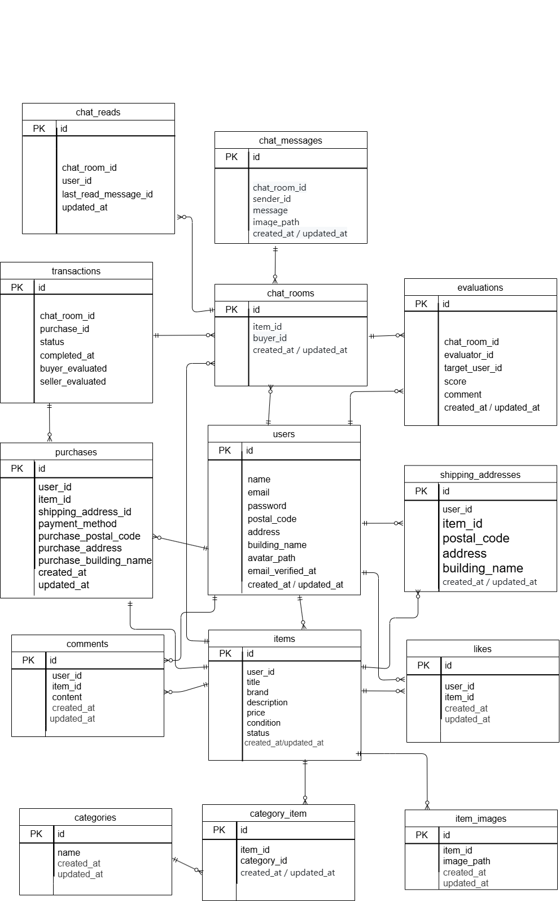

# coachtechフリマ
## 環境構築
**Dockerビルド**
1. リポジトリをクローン
`git clone git@github.com:koto-101/mitani-coachtech-furima.git`
2. ディレクトリを移動
`cd mitani-coachtech-furima/`
2. DockerDesktopアプリを立ち上げる
3. `docker-compose up -d --build`

**Laravel環境構築**
1. PHPコンテナに入る
`docker-compose exec php bash`
2. パッケージインストール
`composer install`
3. .env ファイル作成
```bash
cp .env.example .env
```
4. .env に以下のDB設定を記述
``` text
DB_CONNECTION=mysql
DB_HOST=mysql
DB_PORT=3306
DB_DATABASE=laravel_db
DB_USERNAME=laravel_user
DB_PASSWORD=laravel_pass

MAIL_FROM_ADDRESS=no-reply@example.com
```
5. アプリケーションキーの作成
``` bash
php artisan key:generate
```
6. 設定キャッシュ（.env変更時は都度推奨）  
   `php artisan config:cache`
7. マイグレーションの実行
``` bash
php artisan migrate
```

8. シーディングの実行
``` bash
php artisan db:seed
```

9. storageディレクトリのシンボリックリンク作成 
``` bash
php artisan storage:link
```

## 使用技術(実行環境)
- **OS**: Windows 11
- **言語・フレームワーク**:
  - Laravel 8.4.6
  - PHP 8.2.27
- **認証**: Laravel Fortify
- **バリデーション**: FormRequest
- **メール送信確認**: Mailhog
- **決済処理**: Stripe（Stripe CLI 使用）
- **開発補助**:
  - Docker / Docker Compose


## ER図


## URL一覧
- 開発環境：http://localhost
- phpMyAdmin:：http://localhost:8080
- Mailhog（メール確認）: http://localhost:8025

---

# Stripe WebhookとCLIのセットアップ

Stripeの決済機能を実装するためには、Webhookを受け取る設定と、ローカルでStripeイベントをテストするためにStripe CLIを使用します。

#### 1. Stripe CLIのインストール

以下の公式ドキュメントを参照し、環境に応じてStripe CLIをインストール  
[Stripe CLI インストールガイド](https://stripe.com/docs/stripe-cli#install)

#### 2. Stripe CLIにログイン（初回のみ）
```bash
stripe login
```

#### 3. Webhookの中継設定
```bash
stripe listen --forward-to http://localhost:80/stripe/webhook
```
※ このコマンドは、開発中・テスト中は別ターミナルで継続実行してください
※ `localhost` のポート番号（例: `80` や `8000`）は、実際のアプリ起動ポートに合わせて変更してください

#### 4. Webhook Secret を `.env` に記載
```env
STRIPE_WEBHOOK_SECRET=whsec_**********
```

####  5. Stripe APIキーの取得

以下のページから自分のStripeキーを取得  
https://dashboard.stripe.com/test/apikeys

#### 6. `.env` にStripe関連の環境変数を記述

以下を `.env` または `.env.testing` に追記：

```env
STRIPE_KEY=your_stripe_publishable_key
STRIPE_SECRET=your_stripe_secret_key
STRIPE_WEBHOOK_SECRET=your_stripe_webhook_secret
```

※ これらのキーはセキュリティ上、Gitに含めていません。自身のアカウントで取得し、ローカルに設定してください。

## テストの実行

以下のコマンドでテストが実行できます：

```bash
php artisan test
```

## 備考・補足事項

- 環境変数を変更した際は、`php artisan config:cache` を実行してください。
- Stripe決済テストに関する入力例
  - カード番号：4242 4242 4242 4242
  - 名義：スペース区切りで名字と名前を入力（例：Taro Taguchi）
  - 有効期限：現在より未来の年月を指定
  - セキュリティコード：任意の3桁または4桁の数字

- メール認証後の画面遷移について
機能要件およびテストケースでは「商品一覧画面」へ遷移する仕様となっていましたが、Figmaのデザインでは「プロフィール編集画面」への遷移となっていたため、Figmaを優先し、プロフィール編集画面へ遷移する設計としています。

- マイページから自身の出品商品を選択した場合の遷移について
このケースの遷移先が仕様上明示されていなかったため、商品詳細画面を表示する設計としています。
ただし、自分の商品に対しては購入処理やコメント投稿ができないよう、バリデーションでエラーを表示する処理を実装しています。

最後の2点については、本来であれば仕様確認のうえで対応すべき内容でしたが、提出期限に間に合わない可能性があったため、自身で判断のうえ対応いたしました。
